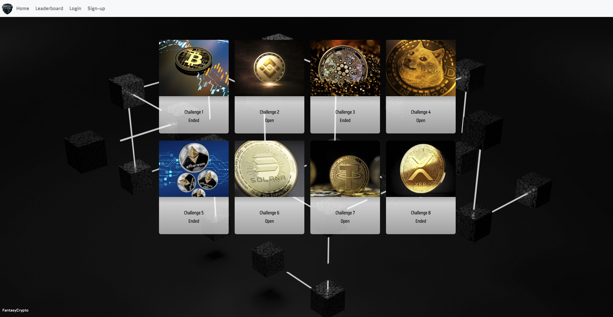

# Fantasy Crypto
<<<<<<< HEAD
=======

>>>>>>> 08e5e98a3bcba32e85726176caf19785467ac373
Check out the app! - [Fantasy Crypto](https://fantasy-crypto1.herokuapp.com/)

Learn about our building process - [Fantasy Crypto Presentation](https://docs.google.com/presentation/d/1eyA2Jt7HzZJRYMVMcgdJqWwgvhX0Teu7o8g6pJQ4Vo8/edit?usp=sharing)

## Description
<<<<<<< HEAD

## Key Features

## Project Team

=======
Fantasy Crypto allows users to compete with other users to build fantasy crypto currency portfolios. This site presents challenges where users build portfolios based on specific parameters such as starting capital and time constraints. These portfolios are then evaluated at the end of the challenge to determine the winner. 

## Key Features
- Creating a new user allows you to join challenges
- Challenges have their own individual parameters such as starting captial, allowed tokens, and time limits
- Application uses coinpaprika API for up to date crypto exchange rates
- Chart.js is uses to show token allocation

## Project Team
- Andrew Ellison: [Github](https://github.com/Ellisonac)
- Reginald Capanzana : [Github](https://github.com/reginaldcapanzana)
- Daniel Beck: [Github](https://github.com/beckdan)
- Ricardo Crossley: [Github](https://github.com/rickyesc1)
>>>>>>> 08e5e98a3bcba32e85726176caf19785467ac373

